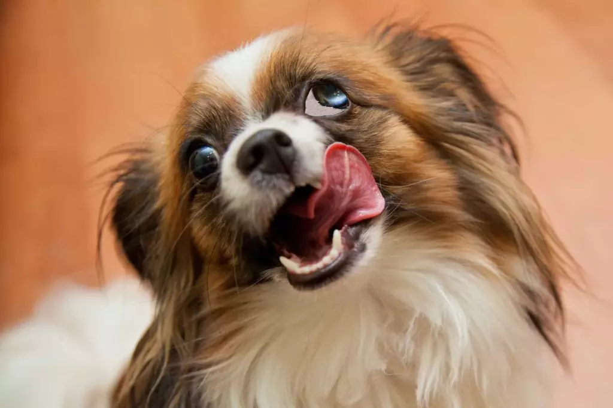
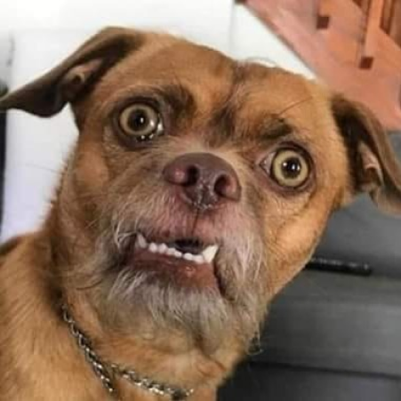

<!DOCTYPE html>
<html lang="en">

<head>
    <meta charset="UTF-8">
    <meta name="viewport" content="width=device-width, initial-scale=1.0">
    <title>Dogs Vesgos</title>

    <link rel="stylesheet" href="estilos.css">
    <link rel="stylesheet" href="https://stackpath.bootstrapcdn.com/bootstrap/5.0.0-alpha1/css/bootstrap.min.css" integrity="sha384-r4NyP46KrjDleawBgD5tp8Y7UzmLA05oM1iAEQ17CSuDqnUK2+k9luXQOfXJCJ4I" crossorigin="anonymous">
    
    

</head>

<body>

    

        

            
            <nav>
                <ul class='menu'>
                    <li><a href="#" class="ativo">Home</a></li>
                    <li><a href="#">Dogs</a></li>
                    <li><a href="#">Quem Somos</a></li>
                    <li><a href="#">Fale Conosco</a></li>
                </ul>
            </nav>
        

    

    

        

            

                

                    
                

            

        

    

    

        

            
Oi

            
Ola

            
Tchau

        

    

    

        

            

                

                    <h1>Cães vesgos</h1>
                    

                        Em 2020, durante uma pesquisa, constatou-se que cães vesgos são gays.
                    

                    

                        Sim, você não leu errado. O motivo do estrabismo canino é causado pelo hábito de tentar olhar o pênis de outros cães disfarçadamente.
                    

                    

                        Segundo o ICV, (Instituto de Cães Vesgays), os cães que desenvolvem esse problema, na sua grande maioria se chamam Rodrigo Leão. Nome comum entre gays da espécie humana, por isso, batizamos esse distúrbio mental de "Rodriguismo" ou "Viadagem estrábica
                        canina".

                    

                    

                        Alguns casos no interior da cidade do Rio de Janeiro, descobriram um distúrbio parecido. O Amaurismo, consiste nos mesmos sintomas, porém com o único diferencial: Crossfit.
                    

                

            

            

                
            

        

    

    

        

            
            
Copyright © Hunters of Tretas 2020, All rights reserved,

        

    

</body>

</html>